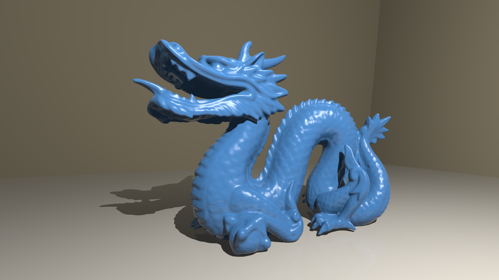

# Ray Tracer

This is a ray tracer written in Java. Ray tracing is a method that simulates how the light interacts with the objects in the real world to create images.

## Renders
### Various Materials

### Cornell Box

### Utah Teapot

### Stanford Dragon

### Sponza Atrium

*I did not upload the model files of the Stanford Dragon and Sponza Atrium as they are large, but they can be found through the links provided in the Resources section. Note that the original models come in various sizes and I resized them, hence, using the original models may result in different outputs.*

## Features
- Spheres and Triangles
- Point Lights
- Shadows
- Blinn-Phong BRDF (Diffuse and Specular Components)
- Phong Shading (Surface Normal Interpolation)
- Reflection (Fresnel Effect using Schlick's Approximation)
- Transmission/Refraction (Snell's Law)
- Texture Mapping (Bilinear Filtering)
- Gamma Correction
- Anti-aliasing
- Multi-threaded Rendering
- OBJ & MTL File Parser
- Bounding Volume Hierarchy

## Future Work
- Loading Scenes from files
- Object Transformations
- GUI
- Physically Based Rendering
- Path Tracing/Monte Carlo Ray Tracing

## Notes
- The ray tracer casts shadow rays to calculate shadows and only supports point lights. As a result, shadows are always hard and indirect illumination is not calculated. Currently, a constant ambient light is assumed for global illumination.

- Image texture can only be used for diffuse component. Specular, bump mapping etc. are currently not supported.

- The project has not been comprehensively tested and may contain some bugs.

## Resources and Useful Links
- [_Ray Tracing in One Weekend_](https://raytracing.github.io/books/RayTracingInOneWeekend.html): A really useful source for ray tracing. Although I did not follow the book, it helped me a lot in understanding some concepts.

- [_The Stanford 3D Scanning Repository_](https://graphics.stanford.edu/data/3Dscanrep/): A repository containing various 3D objects. Stanford Dragon can be found in this repository.

- [_Utah Model Repository_](https://users.cs.utah.edu/~dejohnso/models/teapot.html): Utah Teapot can be found in this repository.

- [_McGuire Computer Graphics Archive_](https://casual-effects.com/data/): Crytek Sponza Atrium can be found in this archive.