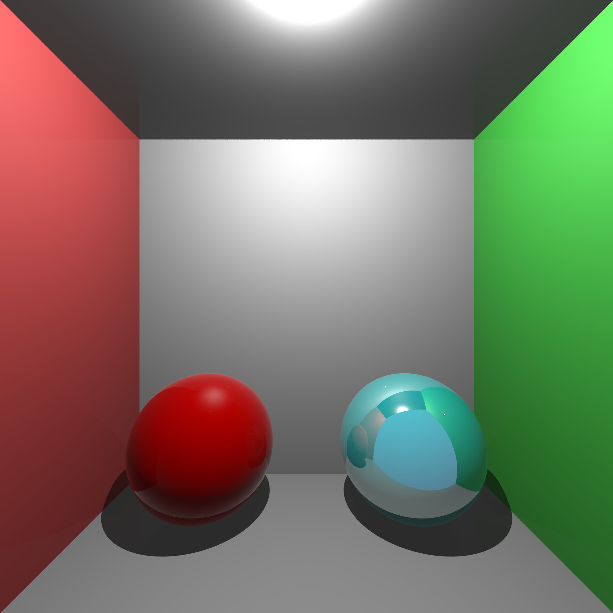
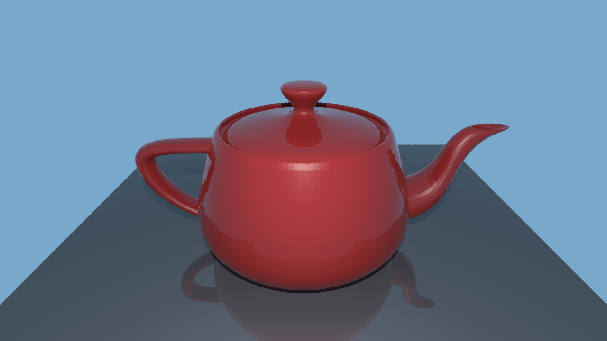

# Ray Tracer

This is a ray tracer written in Java. Ray tracing is a method that simulates how the light interacts with the objects in the real world to create images.

## Renders
### Various Materials

### Cornell Box

### Utah Teapot

### Stanford Bunny

## Features
- Spheres and Triangles
- Point Lights
- Shadows
- Blinn-Phong BRDF (Diffuse and Specular Components)
- Reflection (Fresnel Effect using Schlick's Approximation)
- Transmission/Refraction (Snell's Law)
- Gamma Correction
- Anti-aliasing
- Multi-threading
- OBJ File Parser (only vertices and faces are supported)

## Future Work
- Loading Scenes from files
- Object Transformations
- Texture Mapping
- Phong Shading (use of interpolated triangle normal vectors using vertex normals and barycentric coordinates)
- Bounding Volume Hierarchy
- Path Tracing/Monte Carlo Ray Tracing

## Notes
- The ray tracer casts shadow rays to calculate shadows and only supports point lights. As a result, shadows are always hard.

- Ray tracing is a computationally expensive algorithm. Furthermore, I did not focus on performance and it does not currently have acceleration techniques such as Bounding Volume Hierarchy. Hence, rendering scenes with a high number of shapes can take a very long time even though the rendering is multi-threaded.

- It has a very simple OBJ file parser to import 3D models, but it will only read vertices and faces and ignore vertex normals etc. It doesn't support MTL files either.

- The project has not been comprehensively tested and may contain some bugs.

## Useful Links
- [_Ray Tracing in One Weekend_](https://raytracing.github.io/books/RayTracingInOneWeekend.html): A really useful source for ray tracing. Although I did not follow the book, it helped me a lot in understanding some concepts.

- [_The Stanford 3D Scanning Repository_](https://graphics.stanford.edu/data/3Dscanrep/): A repository containing various 3D objects. Stanford Bunny can be found in this repository.

- [_Utah Model Repository_](https://users.cs.utah.edu/~dejohnso/models/teapot.html): Utah Teapot can be found in this repository.