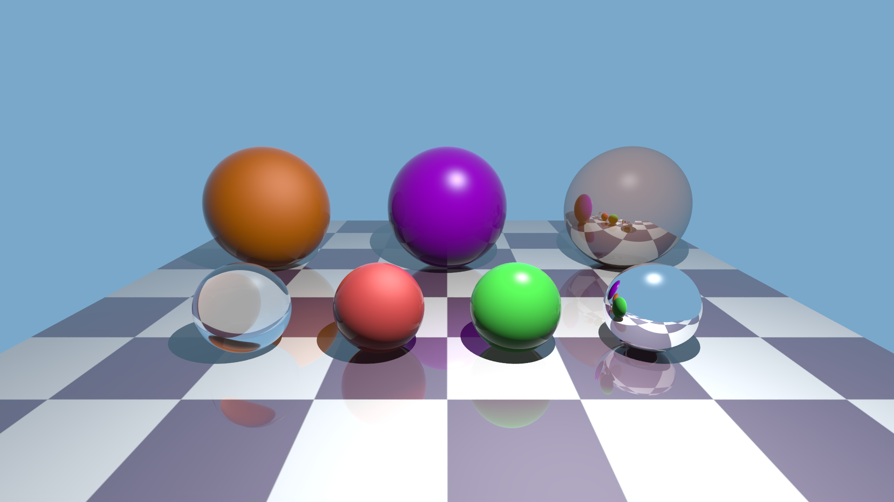

# Ray Tracer

This is a ray tracer written in Java. Ray tracing is a method that simulates how the light interacts with the objects in the real world to create images.

## Renders
### Various Materials

### Cornell Box

### Utah Teapot

### Stanford Dragon

*I did not upload the model file of the Stanford Dragon as it is large, but the model can be found in the Stanford 3D Scanning Repository.*

## Features
- Spheres and Triangles
- Point Lights
- Shadows
- Blinn-Phong BRDF (Diffuse and Specular Components)
- Phong Shading (Surface Normal Interpolation)
- Reflection (Fresnel Effect using Schlick's Approximation)
- Transmission/Refraction (Snell's Law)
- Gamma Correction
- Anti-aliasing
- Multi-threaded Rendering
- OBJ File Parser (only vertices and faces are supported)
- Bounding Volume Hierarchy

## Future Work
- Loading Scenes from files
- Object Transformations
- Texture Mapping
- Physically Based Rendering (BRDF)
- Path Tracing/Monte Carlo Ray Tracing

## Notes
- The ray tracer casts shadow rays to calculate shadows and only supports point lights. As a result, shadows are always hard.

- It has a simple OBJ file parser to import 3D models, but it lacks some features such as reading texture coordinates. It doesn't support MTL files either.

- The project has not been comprehensively tested and may contain some bugs.

## Resources and Useful Links
- [_Ray Tracing in One Weekend_](https://raytracing.github.io/books/RayTracingInOneWeekend.html): A really useful source for ray tracing. Although I did not follow the book, it helped me a lot in understanding some concepts.

- [_The Stanford 3D Scanning Repository_](https://graphics.stanford.edu/data/3Dscanrep/): A repository containing various 3D objects. Stanford Dragon can be found in this repository.

- [_Utah Model Repository_](https://users.cs.utah.edu/~dejohnso/models/teapot.html): Utah Teapot can be found in this repository.